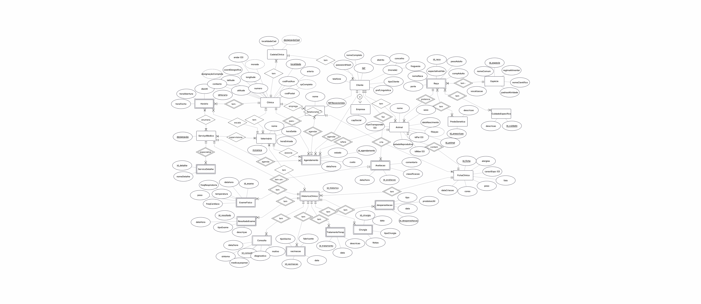

# 🐾 VetCare — Veterinary Clinic Management System

> A full-stack veterinary clinic management system built with MySQL, Java/JDBC, and Jakarta EE, designed for a multi-location chain of veterinary clinics.

**Course:** Database Systems · ISEL 2024/2025

---

## Overview

VetCare is a web-based information system that digitalises and automates the daily operations of a veterinary clinic chain operating across three cities — **Lisbon, Porto, and Évora**. The system handles everything from animal registration and appointment scheduling to full clinical histories and manager-level analytics.

The application supports four distinct user profiles — **tutor (pet owner), receptionist, veterinarian, and manager** — each with role-specific dashboards and permissions. Core processes such as vet assignment, schedule generation, and clinical history updates are automated at the database level using triggers, stored procedures, and views.

---

## Tech Stack

| Layer | Technology |
|---|---|
| Operating System | Windows 11 |
| IDE | Eclipse IDE for Enterprise Java and Web Developers 2025-12 |
| Database | MySQL 8.0 |
| DB Modelling | MySQL Workbench |
| Backend | Java (OpenJDK 17.0.17) |
| DB Connectivity | JDBC — `mysql-connector-j` v9.5.0 |
| Application Server | Apache Tomcat 10.1.36 |
| Frontend | Jakarta Server Pages (JSP) 3.0, HTML5, CSS3, JavaScript (ES6+) |
| Servlets | Jakarta Servlet 6.0 |
| Data Exchange | XML, JSON |

---

## Database Design

### Entity-Association Model

The conceptual model was developed to capture all business requirements of the VetCare chain.



Key design decisions:
- **Clinic chain** — a chain can hold multiple clinics, each identified by location and an internal `idClinica`.
- **Clients** — modelled with a superclass `Cliente` and two exclusive subclasses: `Pessoa` (individual) and `Empresa` (company), each with their own NIF type.
- **Schedules** — each clinic has a daily schedule tied to specific veterinarians, with support for exceptions (holidays, vacations).
- **Clinical record** — a central `HistoricoClinico` entity links all clinical event types: consultations, physical exams, vaccinations, deworming, surgeries, and therapeutic treatments.
- **Genealogical tree** — `FichaClinicaAnimal` includes `idPai` and `idMae` foreign keys to itself, enabling recursive ancestry queries.

### Relational Model

The full relational schema (34 relations) is documented in [`RelationalModel.docx`](RelationalModel.docx).

Key relations include:

```
CADEIA, CLINICA, CLIENTE, RECECIONISTA, ESPECIE, RACA,
PREDGENETICA, CUIDADOSESPECIFICOS, RACA_PREDGENETICA,
RACA_CUIDADOS_ESPECIFICOS, SERVICO_MEDICO, VETERINARIO,
HORARIO, SERVICO_MEDICO_HORARIO, EXCECAO_HORARIO,
VETERINARIO_SERVICO_MEDICO, SERVICO_DETALHE,
FICHA_CLINICA_ANIMAL, ALERGIA, FICHA_CLINICA_ANIMAL_ALERGIA,
AGENDAMENTO, HISTORICO_CLINICO, VETERINARIO_HISTORICO_CLINICO,
SINTOMA, CONSULTA, CONSULTA_SINTOMA, EXAME_FISICO,
RESULTADO_EXAME, VACINACAO, TRATAMENTO_TERAPEUTICO,
CIRURGIA, DESPARASITACAO, AVALIACAO, RECECIONISTA_AGENDAMENTO
```

### Integrity Constraints

- **Entity integrity** — all primary keys are non-null and unique.
- **Referential integrity** — all foreign keys reference existing primary keys; `ON DELETE CASCADE` applied where appropriate.
- **Domain integrity** — phone numbers and NIFs must be exactly 9 digits; sex is restricted to `{M, F}`; vet exit time must be later than entry time.
- **Application integrity** — no duplicate appointments for the same animal at the same datetime; vet availability validated on every appointment; no duplicate schedule exceptions per clinic and date.

---

## Features

### Automated Vet Assignment
When an appointment is created, a **trigger** automatically searches for a vet at the chosen clinic who offers the requested service, is within their working hours, has no conflicting appointments, and has no active exception (holiday/vacation) for that day. If a match is found, the vet is assigned and the appointment is set to `Válido`. If not, the appointment is saved as `Inválido` with an explanatory message — no data is lost.

### Dynamic Schedule Loading
When a user selects a date and clinic, a JavaScript `fetch` request hits the server asynchronously. The servlet queries the database, crosses vet schedules with booked slots, and returns only truly available time windows as JSON. The time selector updates in real time, preventing invalid booking attempts entirely.

### Automatic Schedule Generation
A stored procedure (`PreencherTodosHorarios`) generates all working slots for a vet across an entire year, automatically skipping weekends and exceptions. This turns what would be thousands of manual inserts into a single procedure call.

### Holiday Management
Fixed and moveable national holidays (including Easter) are stored in a `FeriadoBase` table. The procedure `GerarFeriadosAno(p_ano)` populates `ExcecaoHorario` for a given year automatically, with duplicate-prevention logic. Regional holidays are inserted manually per clinic.

### Clinical History Automation
Completing an appointment triggers the `ConcluirAgendamento` procedure, which:
1. Creates a new `HistoricoClinico` record.
2. Links the attending vet via `VeterinarioHistoricoClinico`.
3. Updates the appointment state to `Concluído`.
4. Creates the corresponding clinical event record (consultation, vaccination, etc.).

### Intelligent Rescheduling
Rescheduling preserves full audit history. The original appointment is marked `Cancelado` with the reason `"Reagendado"`, and a new appointment is created from scratch, going through the full trigger validation. If the clinic changes, a different vet may be assigned automatically.

### Genealogical Tree
Recursive SQL queries follow `idPai` / `idMae` references across generations of `FichaClinicaAnimal`, presenting a hierarchical ancestry view with generation levels. Useful for identifying hereditary conditions (e.g. hip dysplasia lineages).

### Export & Import (JSON / XML)
Managers can export a complete animal record — including clinical history and photo (Base64-encoded) — to JSON or XML. Import supports both inserting new records and updating existing ones, with validation of referential dependencies (species, breed).

### Automatic Age & Life Stage Calculation
The clinical record view calculates each animal's age in days, weeks, months, and years in real time. It also classifies the animal into a life stage appropriate for its species (e.g. a 2-year-old rabbit may already be classified as senior).

### Manager Analytics
- Animals that have exceeded their breed's life expectancy.
- Tutors with overweight animals (compared to breed's adult weight standard).
- Tutors with the most cancelled appointments (for commercial follow-up).
- Appointment load by service type for the coming week, broken down per clinic.

---

## Security & SQL Injection Prevention

Security was a deliberate design focus throughout the project. The system was tested against common SQL injection techniques documented in academic literature, and successfully blocked all attempts.

### Three-Layer Defence

#### Layer 1 — Browser-level input restriction
The NIF field uses `type="number"`, which instructs the browser to reject any non-numeric characters (quotes, semicolons, SQL operators) before the request is even sent. This is a UI convenience, not a security guarantee — it can be bypassed via browser DevTools.

#### Layer 2 — Server-side type validation (Java)
Before any SQL is constructed, the NIF value is passed through `Integer.parseInt()`. If the string contains anything other than a valid integer (e.g. `123456789' OR '1'='1`), Java throws a `NumberFormatException`, and the request is terminated immediately. No query is ever built from that input.

#### Layer 3 — PreparedStatements (primary SQL injection defence)
All database queries that incorporate user-supplied data use **PreparedStatements** instead of string concatenation. A PreparedStatement is constructed with `?` placeholders:

```java
// VULNERABLE (never used in this project):
String sql = "SELECT * FROM Cliente WHERE nifCliente = " + nif;

// SAFE (what we actually use):
String sql = "SELECT * FROM Cliente WHERE nifCliente = ? AND passwordHash = SHA2(?, 256)";
PreparedStatement ps = conn.prepareStatement(sql);
ps.setInt(1, nif);
ps.setString(2, password);
ResultSet rs = ps.executeQuery();
```

The JDBC driver compiles the SQL structure **before** the parameters are substituted. At substitution time, the values are treated as **pure data literals** — the database engine never interprets them as code, no matter what characters they contain. A payload like `' OR '1'='1` becomes a literal string value, not executable SQL.

#### Password Security
Passwords are never stored in plain text. On registration or login, the input is hashed with **SHA-256** before any comparison:

```java
// Only the hash is compared — the original password never touches the DB query
ps.setString(2, password); // driver-level, not string-concatenated
// SQL: ... AND passwordHash = SHA2(?, 256)
```

This means that even with direct database access, stored hashes cannot be reversed to recover the original passwords.

### Test Results
All injection payloads tested (UNION-based extraction, boolean blind, stacked queries, UPDATE/DELETE injections, comment-based bypass) resulted in `HTTP 500 — Internal Server Error`, terminating before any SQL was constructed or executed. No data was leaked or modified.

---

## Project Structure

```
vetcare-clinic-management-system/
│
├── vetdatabase.sql              # Full DDL + DML: schema, triggers, procedures, views, test data
├── VetCareWeb.war               # Deployable web application (Apache Tomcat)
│
├── images/
│   └── ea_model.png             # Entity-Association diagram
│
├── RelationalModel.docx         # Full relational schema documentation
│
├── docs/
│   ├── Relatorio_TP1.pdf        # Part 1 report: conceptual and logical design
│   └── Relatorio_TP2.pdf        # Part 2 report: web application and advanced features
│
└── README.md
```

---

## Setup & Deployment

### Prerequisites
- MySQL 8.0
- Apache Tomcat 10.1.36
- Java (OpenJDK 17+)
- `mysql-connector-j-9.5.0.jar` on Tomcat's classpath

### 1. Database Setup

```sql
-- Create and populate the database
SOURCE vetdatabase.sql;
```

The script:
- Creates all 34 tables with constraints.
- Installs all triggers, stored procedures, and views.
- Loads test data (minimum 3 records per table).
- Generates vet schedules and national holidays for 2025–2028.

### 2. Deploy the Web Application

Place `VetCareWeb.war` in Tomcat's `webapps/` directory and start the server:

```bash
./catalina.sh run   # Linux/macOS
catalina.bat run    # Windows
```

Tomcat will automatically extract and deploy the application.

### 3. Access the Application

Open your browser and navigate to:

```
http://localhost:8080/VetCareWeb
```

---

## User Roles

| Role | Access |
|---|---|
| **Tutor** | Login, view/manage own animals, book/cancel/reschedule appointments, view clinical history |
| **Receptionist** | Register tutors and animals, manage appointments for any client, update animal records |
| **Veterinarian** | View daily appointment list, access and update clinical records, conclude appointments |
| **Manager** | Full system access, create vets, generate schedules, analytics reports, export/import clinical data |
